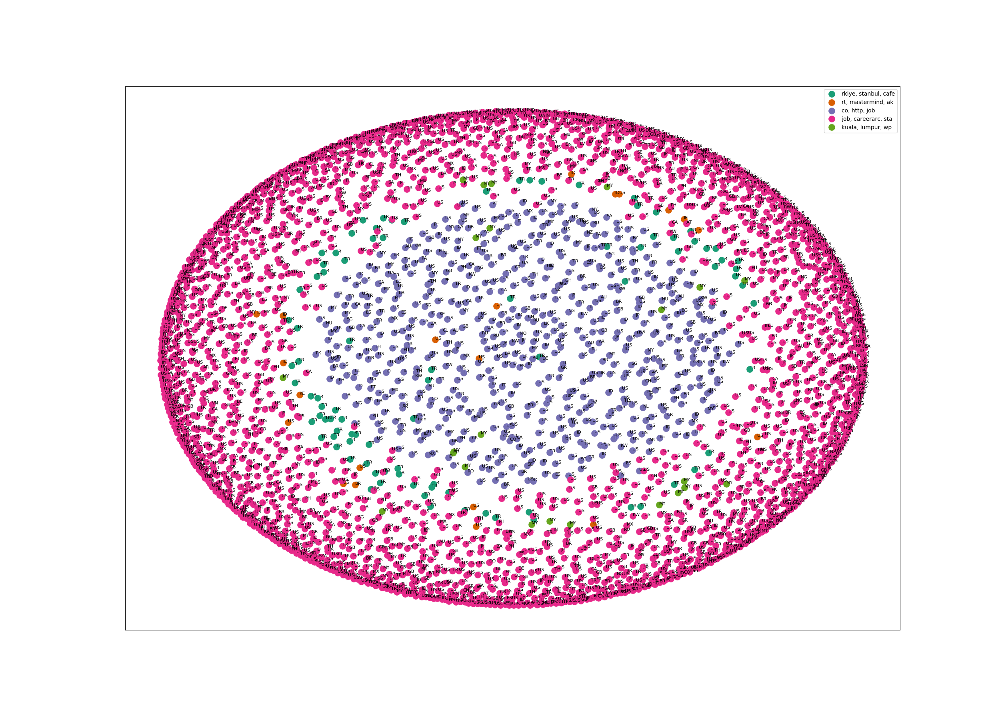
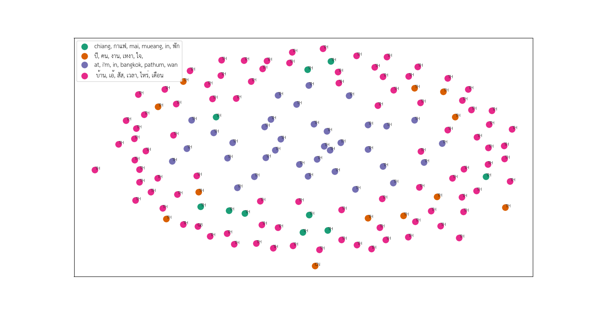

## Environment Setup with Docker
#### How to create, run and access docker container

First, Docker is required to install on your machine.
https://docs.docker.com/ 
```
# Remove old image 
docker rmi $(docker images | grep 'pr_cluster_text_practice')
```

```
#Build Docker Image
cd UMassGlobalTweetClustering/
docker build . -t pr_cluster_text_practice

#Start Docker Container
docker run -it --rm -d -p 8813:6006 -v $(pwd):/workdir pr_cluster_text_practice bash

Access to running container
docker ps
docker exec -it [CONTAINER_ID] bash

# Run jupyter notebook
jupyter notebook --port=6006 --allow-root "$@" --ip 0.0.0.0 --no-browser &
```

#### Access to jupyter notebook
```
http://[your_ip_address]:8813
```


## Result Summary
#### Dataset
For ease of finding the dataset and reproducing the result, the dataset is downloaded from https://www.kaggle.com/rtatman/the-umass-global-english-on-twitter-dataset

This dataset contains 10,502 tweets, randomly sampled from all publicly available geotagged Twitter messages, annotated for being in English, non-English, or having code switching, language ambiguity or having been automatically generated. It includes messages sent from 130 different countries.

There is a total of 55 phone numbers extracted using regex rule. Some of the extracted numbers may not be a real phone number. For example, "5555555555" in Thai means "hahahahahaha", and some can be number that represents money. This kind of patterns requires specific language knowledge to figure it all out.

#### English Data Cluster


This dataset contains 5086 rows of English messages.

After cleaning the texts and filtering out unused words, the text messages are converted to Tf-idf vector then do clustering using k-means with number of cluster equal to 5.

According to the top terms per k-means cluster,

There are 93 messages in Cluster 0 represent twitter messages from Turkey

There are 21 messages in Cluster 1 represent retweet messages

There are 2633 messages in Cluster 2 represent the concept of 'co', 'http', 'job', 'careerarc', 'hospitality'

There are 2390 messages in Cluster 3 represent the concept of 'job', 'careerarc', 'sta', 'retail', 'friday', 'god'

There are 23 messages in Cluster 4 represent messages from Malaysia


#### Thai Data Cluster


This dataset contains 147 rows of Thai messages.

After cleaning the texts and filtering out unused words, the text messages are converted to Tf-idf vector then do clustering using k-means with number of cluster equal to 4.

According to the top terms per k-means cluster,

There are 10 messages in Cluster 0 represent "Chiang Mai" and "Coffee"

There are 12 messages in Cluster 1 represent the concept of "lonely hearts"

There are 35 messages in Cluster 2 represent "Bangkok"

There are 90 messages in Cluster 3 represented with these words บ้าน, เอ้, สัส, เวลา, ไหร่, เดือน, โอกาส, เพลง, ค่า
